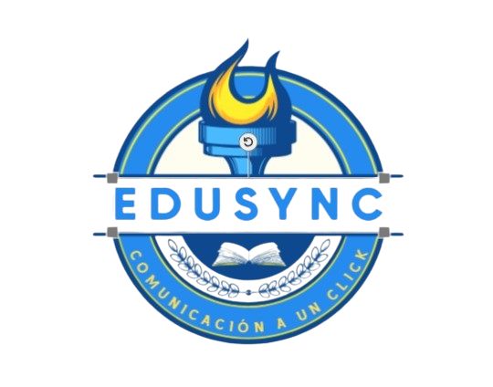

# EduTech c18-05-m-node-react <p align='left'>  </img> </p>


# Aplicación de Escritorio - NoCountry

<p align="left">
  
</p>

## Objetivos de la Aplicación

- utlizar: React, Redux, Node, Sequelize y postgresql.
- Conectar a: Representates, estudiantes profesores y administradores.
- Mejorar la comunicación con la Institución.

## Representantes y estudiantes

- Promedio: Valor del promedio
- Exámenes: Vista de exámenes próximos.
- Resumen de mensajes recientes: Comentarios del profesor
- Avisos de eventos

## Profesores

- Lista de grados -> Lista de alumnos por grado
- Boletas para alumnos
- Campo de texto para mensajes 
- Crear evento

## Administrador

- Crear estudiante
- Crear profesor
- Crear padre
- Dar de alta y baja al usuario
- Editar datos del usuario
- Lista de grados
- Vista del tutor
- Enviar mensaje a padres y profesores


__IMPORTANTE:__ Solo los administradores pueden crear alumnos y profesores, si algun usuasio no autorizado intenta ingresar, saldra una notificación informando que debe comunicarse con la Administración del colegio para poder hacerlo.


## Instalación

  - Npm o Yarn
  - npm run dev o yarn dev
  - Base de datos npm i y npm start

## Crear variables de entorno 

en el back a la altura del `package.json` en un archivo `.env` con la siguiente estructura:

```
DB_USER = usuariodepostgres
DB_PASSWORD = passwordDePostgres
DB_HOST = localhost
DB_NAME = nombreDeBaseDeDatos
PORT = 3001
JWT_TOKEN_SECRET = secretoDeJWT
CLAVE_API_SENDGRID = claveapisendgrid
ACOUNT_GMAIL_SENDGRID = correoregistradoensendgrid
```

> **Nota:** Se detallaran los Endpoints de la API a utilizar:

#### Método GET

- Estudiantes [ ]`/students/searchAll ` 
- Padres [ ]`/parent/searchAll`
- Profesores [ ]`/teachers/allTeacher`
- Administradores [ ]`/admin`

#### Método POST

- Estudiantes `/students ` 
- Padres `/parent`
- Profesores `/teachers`
- Administradores `/admin`
- Login `/login`


